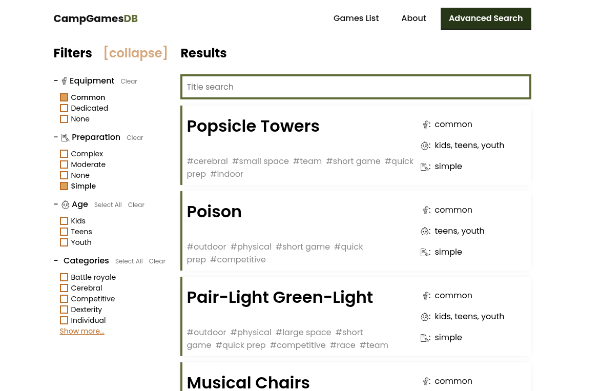

- Source: [link](https://gitlab.com/campgamesdb/campgames-db)
- Website: [link](https://www.campgamesdb.com/)

## What is it
CampgamesDB is an open source, ad-free, curated database of summer camp activities with detailed instructions, illustrations, cost breakdown. Even though it is a static website, it features attribute filter and title search. It is hosted for free on GitLab Pages.

It is build on top of the eleventy.js static site generator.

## The "Advanced Search" page

Usually, a website that is serverless/statically generated would use an external search service like [Algolia](https://www.algolia.com/) for their full-text search. As CampgamesDB is not a documentation website, I presume people are not going to be using full-text search, but would just like to filter down games according to their budget and scope, which is why I implemented an attribute filter.

All game attributes are written into the YAML front matter of the Markdown document. At the moment, our editor is putting those values in during his editing time by hand, but when we move to a visual CMS (Decap CMS), there will be a widget that would let the editor set those up through dropdowns and whatnot.

## Technologies used

- JavaScript
    - [eleventy.js](https://www.11ty.dev/) static site generator
    - "Pages DB" (attribute filter and title search solution)
- Nunjucks (templating language)
- Markdown
- Gitlab CI/CD (for "build and deploy" on push)
